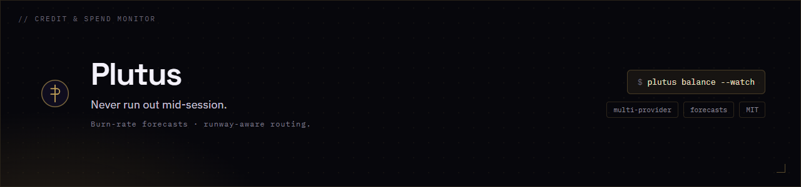

<div align="center">
  
</div>

# Plutus — the billing layer for AI agents

[](https://github.com/Perseus-Computing-LLC/plutus/actions/workflows/test.yml)
[](https://pypi.org/project/plutus-agent/)
[](LICENSE)

> Named for the Greek god of wealth. Plutus is self-hosted, Stripe-integrated
> usage metering and prepaid-credit billing for LLM/agent spend — drop it into
> your agent, see every call's cost live, and bill against prepaid credit.

**Four things in one, which no OSS tool does together:**

- **Live balance monitoring** — real per-provider balances fused with your ledger
- **Ledger spend** — append-only, integer-micro-dollar credit ledger
- **Self-calibrating budgets** — back-solve a budget from real balance vs. spend
- **Runway routing** — shift your flagship model to the provider with the most days left

Plutus *bills*, it doesn't proxy your calls — it complements gateways (LiteLLM,
OpenRouter) and observability (Langfuse, Helicone) rather than replacing them.

### Plutus measures — Perseus saves

Plutus is one of three independent tools in the Perseus ecosystem. **Perseus**
(routing / resolve-before-context) and **Perseus Vault** (agent memory) are what
*reduce* your spend; **Plutus** *meters* it and *proves* the savings on a
tamper-evident chain. Each runs standalone — on its own, Plutus is a "track my own
spend, verify I'm getting the tokens I pay for" meter. Run them together for the
biggest win. The savings-share applies only when Perseus is in the loop producing
(and Plutus proving) real savings — never for standalone metering.

```bash
pip install plutus-agent          # stdlib + PyYAML; Stripe optional
plutus demo                       # zero-setup tour with a month of sample data
#   → open http://localhost:8420
```

## Meter spend from your code

One import. Each `track()` writes an immutable usage event, prices it (exact cost
if you pass one, else estimated from tokens), and depletes prepaid credit.

```python
from plutus_agent import Meter

plutus = Meter(org="Acme Agents")
resp = client.messages.create(model="claude-opus-4-8", ...)
plutus.track(provider="anthropic", model="claude-opus-4-8",
             task_type="code_review", workspace="ci",
             input_tokens=resp.usage.input_tokens,
             output_tokens=resp.usage.output_tokens)
print(plutus.balance())           # remaining prepaid credit
```

This `Meter` is fully offline — its own SQLite database, no network — so it's safe
in any agent hot path. Point it at a **hosted** Plutus instead by passing
`remote=` + an API key (see [Send usage to a hosted instance](#send-usage-to-a-hosted-instance)).

Prepaid credit is enforced on this embedded path too, not just the hosted API: if
an org holds credit and a `track()` would push the balance below zero, the call is
not recorded and the result has `over_balance=True` (set
`pricing.block_over_balance=False` to opt out; orgs that never topped up are never
blocked).

## What you get

| Capability | Description |
|---|---|
| **Usage metering** | Per provider / model / task-type / workspace, with token→cost estimation and exact-cost passthrough |
| **Prepaid credit** | Append-only ledger that depletes as calls land; balance is the sum of deltas (robust to out-of-order inserts) |
| **Live dashboard** | Dark-themed spend dashboard at `:8420` — balance, burn, per-provider/workspace/task breakdowns, live activity feed |
| **Multi-tenant** | Organizations → workspaces → users, with per-org plans and limits |
| **Ingest API** | `POST /v1/usage` with an API key — meter from any language or host ([docs](docs/api.md)) |
| **Self-serve** | Open Google sign-in → a new Free-tier org per user → in-app upgrade nudges |
| **Stripe billing** | Prepaid-credit top-ups, Pro Checkout, Customer Portal, idempotent webhooks — all optional/offline-safe |
| **Alerts & reports** | Low-balance / budget-cap alerts (email) and monthly PDF/HTML spend reports |
| **Tamper-evidence** | Cryptographic hash chain of usage events + externally-retained checkpoints for independent verification |

## Run the dashboard

```bash
plutus init --org "Acme Agents" --tier pro --workspace ci --budget 100
plutus topup --amount 50          # add prepaid credit (Stripe does this in prod)
plutus meter --provider anthropic --model claude-opus-4-8 \
             --task code_review --workspace ci --input 8200 --output 2400
plutus serve                      # live dashboard at http://localhost:8420
```

## Send usage to a hosted instance

Run one Plutus and have many machines/agents report into it over HTTP — no shared
database. Mint a key, then send events.

```bash
plutus keys create --name "prod agent"        # prints a plutus_sk_… secret once
```

From the SDK (same `track()` call, just remote):

```python
from plutus_agent import Meter

plutus = Meter(remote="https://plutus.perseus.observer",
               api_key="plutus_sk_…")          # or env PLUTUS_REMOTE_URL + PLUTUS_API_KEY
plutus.track(provider="anthropic", model="claude-opus-4-8",
             input_tokens=1200, output_tokens=800, task_type="code_review")
```

Or straight over HTTP — `POST /v1/usage`:

```bash
curl -X POST https://plutus.perseus.observer/v1/usage \
  -H 'Authorization: Bearer plutus_sk_…' \
  -d '{"provider":"anthropic","model":"claude-opus-4-8",
       "input_tokens":1200,"output_tokens":800,"workspace":"prod"}'
```

Set `PLUTUS_REMOTE_URL` + `PLUTUS_API_KEY` and remote mode is auto-detected, so the
provider adapters and the Claude Code hook (below) report to your hosted instance
with no code change. Full reference: [docs/api.md](docs/api.md).

## Plans

One meter underneath, three ways to pay for it — the **savings-share** is a
single lever set differently per tier (suggested → waived → mandatory):

| Plan | Price | For | Savings-share |
|---|---|---|---|
| **Free** | $0 | Individuals — unlimited metering + verify you're getting your tokens | **Suggested** — an optional tip jar |
| **Pro** | $20 / mo | Power users — full reporting, leakage, chain-verifiable ledger, export | **Waived** — the flat price replaces it |
| **Team** | $10 / seat / mo | Companies — individual + aggregate attribution, admin | **Mandatory** — 10% of provable savings |
| **Enterprise** | Custom | Org-wide FinOps — SSO, SLA, self-hosted | Negotiated |

Free meters **unlimited** so the savings billboard keeps running; the paywall is
reporting *depth*, not volume. The token-cap mechanism still exists for any
capped/custom tier (past the cap, events are still recorded but flagged
`over_free_limit` — no billing data is ever dropped; `pricing.block_over_free_limit`
hard-stops ingestion). The public `/pricing` page compares plans. See
[docs/three-tier-model.md](docs/three-tier-model.md).

**Savings-share** is the value-based path: meter a call with a `baseline_cost_usd`
(what it would have cost without Perseus) and Plutus bills the agreed share of the
provable, tamper-evident savings — never a blanket percentage. See
[BILLING.md](BILLING.md#6-savings-share-billing-the-perseus-value-path) and
[docs/savings-share.md](docs/savings-share.md).

## Integrations

Normalize a provider response into a meter call:

```python
from plutus_agent import Meter
from plutus_agent.integrations import track_anthropic, track_openai

msg = anthropic_client.messages.create(model="claude-opus-4-8", ...)
track_anthropic(Meter(org="Acme"), msg, task_type="code_review")
```

**Claude Code hook** — meter every coding turn automatically:

```bash
plutus install-claude-hook        # merges a Stop hook into ~/.claude/settings.json
```

The hook (and the adapters) honor `PLUTUS_REMOTE_URL` / `PLUTUS_API_KEY`, so they
can report to a hosted instance with no code change.

## Billing (Stripe)

Stripe is optional — leave the keys unset and Plutus runs fully offline with
billing shown as "test/offline." To enable live billing:

```bash
plutus stripe-setup               # creates the Pro product/price
export STRIPE_SECRET_KEY=rk_live_…
export STRIPE_WEBHOOK_SECRET=whsec_…
```

The dashboard then offers prepaid-credit top-ups, Pro Checkout, and a Customer
Portal; the `/webhook/stripe` handler is signature-verified and idempotent.
Secrets provided via environment are never written back to `config.yaml`.

## Self-hosting

```bash
docker run -p 8420:8420 -v plutus-data:/data \
  ghcr.io/perseus-computing-llc/plutus:latest
```

Sign-in is **off** by default (fine for localhost / behind a trusted proxy). Turn
on app-native **Google OIDC** to require login, and `auth.allow_signup` for open
self-serve signup. See [docs/auth.md](docs/auth.md). Config lives in
`~/.plutus/config.yaml`; every secret is overridable by environment variable.

## The original credit monitor (`plutus.py`)

Plutus began as a provider **credit monitor and runway-based model router** for
Hermes Agent, and that tool still ships in this repo. It tracks money draining
from LLM providers (live DeepSeek/OpenAI balances + a spend ledger) and rebalances
routing toward the provider with the most projected days-left.

```bash
python plutus.py                                  # balance / spend / runway table
python plutus.py --calibrate anthropic=74.46      # back-solve a budget from console balance
python plutus_route.py --dry-run                  # preview a routing rebalance
python plutus_route.py --backtest cost-cap        # replay history against a policy
```

Routing policies (`runway`, `cost-cap`, `latency-weighted`, `quality-floor`, or
stacked) and provider budgets are configured in `plutus.budgets.json` — see
`plutus.budgets.example.json`.

| File | Purpose |
|---|---|
| `plutus.py` | Monitor — balance, spend, runway, forecast, calibrate, alert |
| `plutus_route.py` | Balancer — runway-based routing + policy engine + backtest |
| `plutus-refresh.sh` | Cron driver |
| `plutus.budgets.example.json` | Budget / alerts / routing template |

The monetization engine (`plutus_agent/`) bridges to this monitor via subprocess
rather than importing it, so the two ship and run independently.

## Docs

- [docs/ledger-integrity.md](docs/ledger-integrity.md) — cryptographic tamper-evidence and externally-retained checkpoints
- [docs/api.md](docs/api.md) — the `/v1/usage` ingest API + API keys + SDK remote mode
- [docs/auth.md](docs/auth.md) — Google sign-in, allow-listing, and open signup
- [docs/claude-code.md](docs/claude-code.md) — the Claude Code metering hook
- [docs/reconciliation.md](docs/reconciliation.md) — true-up estimated cost to a provider's authoritative billing
- [CHANGELOG.md](CHANGELOG.md)

## License

MIT — see [LICENSE](LICENSE). © Perseus Computing LLC.

## Health endpoint

`GET /healthz` — unauthenticated liveness probe, safe for public uptime monitors.

- Success: HTTP 200, body `{"ok": true, "version": "<semver>", "demo": <bool>}`
- Exposes no data, balances, orgs, or credentials (path is explicitly public in `server/app.py`).
- `/health` (no `z`) is **not** the probe path — it redirects to login when auth is enabled.

*Documented 2026-07-19 after live verification against production.*
